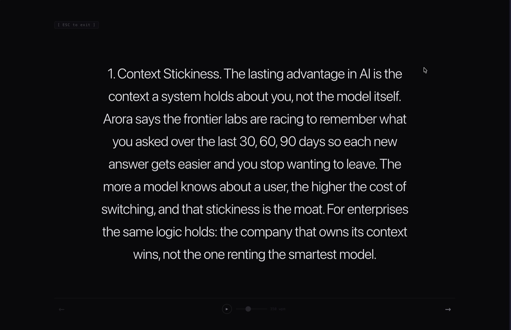

# Focus Reader

**Turn any article into a full-screen deck of single thoughts — and let it read itself to you.**

Focus Reader is a Chrome extension (Manifest V3, no build step, no dependencies) that pulls the article out of a cluttered web page and re-renders it in its own tab as slides: one thought at a time, dead-center on black, nothing else on screen. Step through with a click or a key — or press `P` and it plays itself like a teleprompter at your chosen words-per-minute.

No ads. No popups. No servers. The extension makes **zero network requests** — everything happens locally in your browser.



## Why

Reader modes (Safari Reader, Chrome Reading Mode) clean up the clutter, but they still hand you one enormous vertical document. You scroll, lose your line, re-find it, scroll again. Focus Reader removes the document entirely: the words come to you, your eyes stay put.

## Features

- **Read-along highlight**: during autoplay the slide does not sit still. The line carries three tones at once, so what your eye tracks is a single travelling marker rather than the edge of a growing block: words ahead sit pale, the word being spoken carries full ink, and words already passed settle back to a middle tone. The step is deliberately faster than one word's dwell, so each word lands crisply instead of smearing into the next. Pausing reveals the whole slide at full contrast. Toggle with `R`.
- **Two themes**: the original black reading room, and **paper**, a warm off-white sheet, serif throughout, left-aligned like a page. Toggle with `T`. Theme, read-along and WPM persist between sessions.
- **Type that fills the sheet** (paper theme): instead of a fixed scale, each slide's font size is solved by binary search to the largest that still fits the viewport, so a short line lands as a poster and a dense passage steps down only as far as it has to. Re-solves on window resize. The dark theme keeps its original fixed scale.
- **Full-bleed sheet** (paper theme): paper runs edge to edge with only a thin gutter, no column cap, which buys more words per line and a longer sweep for the read-along to travel. The dark room deliberately keeps its 800px measure, because its type sits at a fixed scale and a full-bleed line at that size would be a punishing distance for the eye to return from.
- **One thought per slide** — text is chunked into ~200-character slides on sentence boundaries, so each slide is a complete thought, never a truncated fragment.
- **Autoplay teleprompter** — press `P` or hit the play button. Slide duration is computed from word count ÷ your WPM setting (150–700, slider in the control bar, default 350). A timer bar along the bottom shows when the next slide arrives. Short slides are clamped to a 1.2s minimum so a three-word slide doesn't blink past.
- **Dynamic type scaling** — short punchy fragments render extra large; dense passages step down so they never wrap awkwardly. Headings and blockquotes keep their own hierarchy.
- **Composites stay whole** — tweets, blockquotes, embeds, and images are never shredded into fragments; each renders as a single full-screen slide.
- **Selection-aware clicks** — drag to select text without accidentally turning the page (a 6px movement threshold tells a selection apart from a click).
- **Sandboxed reading room** — the reader runs in its own `chrome-extension://` tab, so the host page's styles, scripts, and popups can't touch it.

## Install

The extension isn't on the Chrome Web Store yet — load it unpacked (takes under a minute):

1. **Get the code**

   ```bash
   git clone https://github.com/arnavbee/focus-reader-extension.git
   ```

   (or *Code → Download ZIP* and unzip it)

2. **Load it into Chrome**

   - Open `chrome://extensions` (or `brave://extensions`, `edge://extensions`)
   - Toggle **Developer mode** on (top-right)
   - Click **Load unpacked** (top-left)
   - Select the `focus-reader-extension` folder

3. **Read something**

   Open any article, click the Focus Reader icon in your toolbar, and the reading room opens in its own tab. Press `P` to let it drive.

   > **Note:** tabs that were already open before you installed the extension need a refresh before the icon will work on them.

## Controls

| Input | Action |
|---|---|
| Click right half / `→` / `Space` | Next thought |
| Click left half / `←` | Previous thought |
| `P` (or play button) | Autoplay on / off |
| `R` | Read-along word highlight on / off |
| `T` | Switch theme (dark / paper) |
| WPM slider | Reading speed, 150–700 wpm — adjusting mid-slide restarts the timer at the new pace |
| Drag | Select text without navigating |
| `Esc` / `F` | Close the reading room |

## How it works

```
Toolbar click
      ↓
content.js walks article / main / [role="main"]
  keeps h1–h3, p, li, figures, images, embeds — in document order
  drops nav, footers, sidebars, comments, recommendation widgets
  dedupes the duplicate nodes CMS templates love to emit
      ↓
Structured items → chrome.storage.local
      ↓
focus.html opens in its own sandboxed tab
  chunks text into ~200-char slides on sentence boundaries
  wraps every word in its own span
  renders one slide at a time, lighting words at word-duration = 60000/wpm
  (long words cost more, punctuation buys a breath)
  each word moves pale → full ink → settled as the marker passes over it
```

Six files, ~1,300 lines total:

| File | Role |
|---|---|
| `manifest.json` | MV3 config — `activeTab`, `storage`, `scripting`, host permissions |
| `background.js` | Service worker; relays the toolbar click to the content script |
| `content.js` | Extractor — finds the article container, filters clutter, handles nested/composite blocks |
| `focus.html` / `focus.js` / `focus.css` | The reading room — slide deck, autoplay, controls |

## Privacy

Focus Reader sends nothing anywhere. There are no analytics, no external requests, and no remote code — extracted article content lives in `chrome.storage.local` on your machine and is overwritten on the next extraction. Host permissions exist solely so the extractor can read the page you explicitly invoke it on.

## Contributing

Issues and PRs welcome. The codebase is deliberately plain — vanilla JS, no framework, no build step — so a fix is usually a small diff. If a site extracts badly, open an issue with the URL; the clutter-filter selectors in `content.js` are the usual suspect.

## License

MIT
